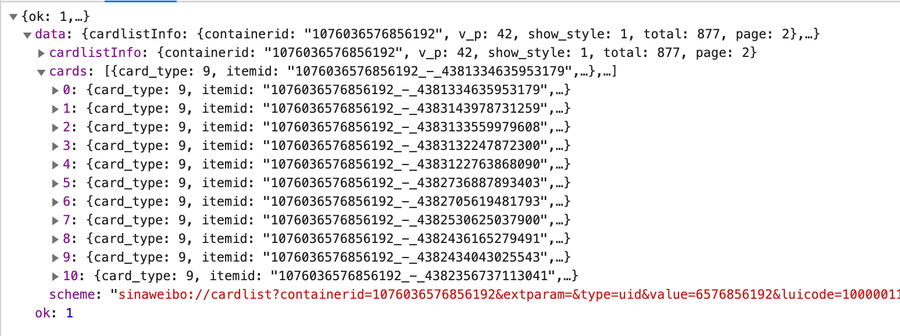
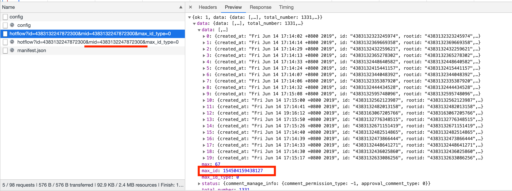

# weiboSpider
用python爬取新浪微博和评论数据（闲得无聊写的，没仔细调试…）

## 前言
本人长这么大第一次深入饭圈追星，逐渐了解了饭圈所谓的“做数据”后，对大量的评论转发比较好奇，所以尝试写了一个爬虫抓取的code。具体参考了如下两个链接（原始code并没有发布在github上，无法fork）

* [Python抓取微博评论](https://www.cnblogs.com/chenyang920/p/7205597.html)
* [python爬虫抓取新浪微博数据](https://www.jianshu.com/p/c4ef31a0ea8c)

私心放一张妹妹照片！！！我妹妹真的超级好！！！希望大家有机会可以了解一下！！！入股不亏！！！


## 数据加载

首先，整个程序是通过模拟手机端访问http://m.weibo.com 来请求数据的，因此首先要找到要访问的主页的网址。以火箭少女101官博为例，
```
def get_user_info(page):
    params = [
        ('type', 'uid'),
        ('value', 6576856192),
        ('containerid', 1076036576856192),
        ('page', page)
    ]
```
### 用户
可以看到，每一个用户都有指定的ID，在程序中只要替换params的value和containerid即可访问相应的用户。


### 微博
在chrome的development tool功能下可捕捉到如图所示的请求。


图片里高亮的Link即为Request URL，里面包含了该微博用户目前发表前10条微博的所有信息（如果需要抓取更多微博，调整params里的变量page即可，默认0）。Jason数据结构如下图所示




### 评论
目前微博的评论有两种排序方式，一个是时间，一个是热度（热度的排序机理我不是很了解，貌似是点赞越多排的越高？？），而网页版微博目前默认显示热度排序，及hotflow。Jason数据结构如下图所示



每个container里包含了最热的20条评论。不同于微博信息的情况是，hotflow没有page变量来控制顺序，而是通过“mid”来排序。默认的mid和该微博的专属id相同，如上图画横线部分。而该微博数据中，包含了下一条评论包的max_id，因此只要设置循环并记录上一条mid，即可访问到下一个包。


## 数据存储
目前程序只能完成访问…未完待续吧……（估计我懒得写了…）

