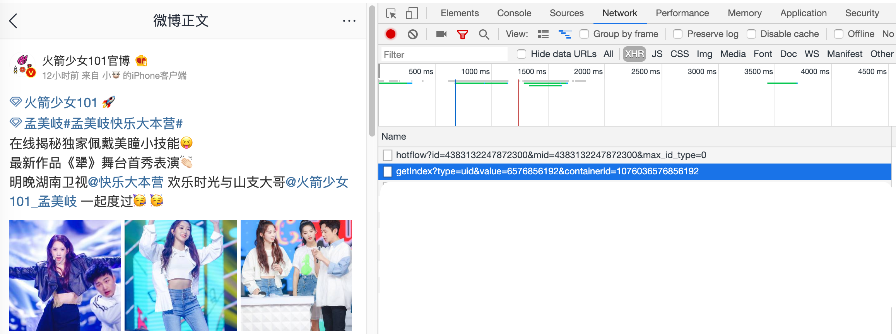

# weiboSpider
用python爬取新浪微博和评论数据（闲得无聊写的，没仔细调试…）

## 前言
本人长这么大第一次深入饭圈追星，逐渐了解了饭圈所谓的“做数据”后，对大量的评论转发比较好奇，所以尝试写了一个爬虫抓取的code。具体参考了如下两个链接（原始code并没有发布在github上，无法fork）

* [Python抓取微博评论](https://www.cnblogs.com/chenyang920/p/7205597.html)
* [python爬虫抓取新浪微博数据](https://www.jianshu.com/p/c4ef31a0ea8c)

私心放一张妹妹照片！！！我妹妹真的超级好！！！希望大家有机会可以了解一下！！！入股不亏！！！


## 数据是如何加载的

首先，整个程序是通过模拟手机端访问http://m.weibo.com 来请求数据的，因此首先要找到要访问的主页的网址。以火箭少女101官博为例，

可以看到，每一个用户都有指定的ID，在程序中只要替换params的value即可访问相应的用户。而params中的containerid，代表的是该用户发布的每一条微博的专属id。
```
def get_user_info(page):
    params = [
        ('type', 'uid'),
        ('value', 6576856192),
        ('containerid', 1076036576856192),
        ('page', page)
    ]
```


